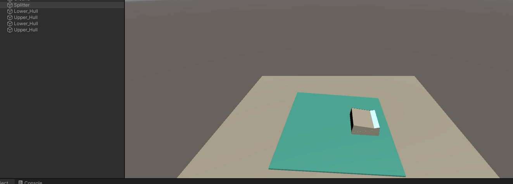

# Ezy-Slicer-Sample
Sample code for Ezy-Slicer Usage. Reference: https://www.bilibili.com/video/BV1J441167aS?from=search&seid=2437021187217130398

### How To Use
- Core function achieve in the Splitter.cs. 
- Create a mask to slice items. (e.p. CutLayer)
- Assign the Layer and layer number to the field maskLayer & maskLayerNumber
- Move Mouse to rotate and left click to cut.
- Change the matCross with specific shader to change the cutting face material. 

### Demo
